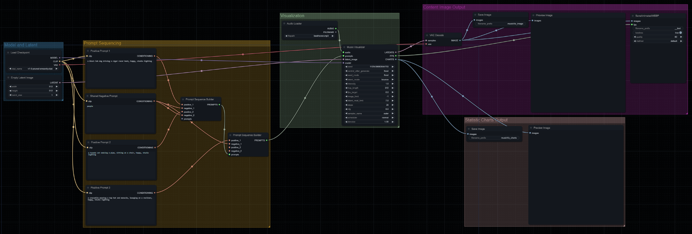

# MBM's Music Visualizer

>
> Nothing fuzzy about it.
>

- [MBM's Music Visualizer](#mbms-music-visualizer)
  - [What is it?](#what-is-it)
  - [Includes](#includes)
    - [Nodes](#nodes)
    - [Types](#types)
  - [Install](#install)
  - [Usage](#usage)
  - [Documentation](#documentation)
  - [Roadmap](#roadmap)

---

## What is it?

An image generation based music visualizer integrated into [comfyanonymous/ComfyUI](https://github.com/comfyanonymous/ComfyUI) as custom nodes.

## Includes

### Nodes

* `Audio Loader`: For loading an audio file using the [librosa](https://librosa.org) library.
* `Audio Feature Calculator`: For calculating the audio feature modifiers for each step in the given audio.
* `Prompt Sequence Builder`: For stacking multiple ComfyUI prompts into a Prompt Sequence.
* `Prompt Sequence Interpolator`: For calculating additional sub-prompts within each set of prompts in Prompt Sequence to create a weighted interpolation transition between each.
* `Prompt Sequence Renderer`: For rendering a sequence of images with a variety of parameters from a Prompt Sequence.
* `Image Concatenator`: For combining multiple images into a single Tensor. Images are _not_ visually combined and are still distinct.
* `Prompt Sequence Loader`: For loading a sequence of prompts from a JSON file fitting the [specifications found here](./docs/PromptSequenceJsonSpecs.md).

### Types

* `AUDIO` (`tuple[ndarray, float]`): For representing loaded audio files.
* `TENSOR_1D` (`Tensor[*]`): For representing a 1D Tensor of data.
* `PROMPT_SEQ` (`list[MbmPrompt]`): For representing multiple prompts (positive and negative) in an ordered sequence.

## Install

1. Enter ComfyUI's Python Environment by running `.\.venv\Scripts\activate` from ComfyUI's root directory.
2. Clone this repo into ComfyUI's `custom_nodes` directory by entering the directory and running: `git clone git@github.com:Sorcerio/MBM-Music-Visualizer.git MBM_MusicVisualizer`.
3. Enter the `MBM_MusicVisualizer` directory.
4. Run `pip install -r .\requirements.txt` to install this project's dependencies.
5. Start ComfyUI as normal.

Nodes will be found in the `MBMnodes/` submenu inside ComfyUI.

## Usage

> 📝 **Note:** Drag [the example workflow file](./assets/ExampleMusicVisualizer.json) into ComfyUI to automatically load this flow!

Place any audio files you would like to load in the [audio/](./audio/) directory.
You can always refresh the webpage ComfyUI is loaded into to refresh the list in the `Audio Loader` node.

The `Music Visualizer` node takes an `AUDIO` object in and produces a set of Latent Images on output.
A `tqdm` progress bar will be shown in the console to display the current status of the visualization and how long it is expected to take.

Upon completion of a visualization, the `Music Visualizer` will output the input FPS, a set of Latent Images that can be decoded using the ComfyUI-native Latent Decoder, and a set of Images showing relevant data from the run.
The FPS can be fed into any further video or GIF generating nodes.
The Latent Images, which are the output content of the visualization, should be converted and either saved individually or compiled into a video through another node.
The charts are pixel images that can be saved or modified as desired.

_When testing your generations_, consider bypassing the `Prompt Sequence Renderer` and its outputs.
(Alternatively, set the `image_limit` to `1` or higher to generate only a specific number of images.)
Doing so **will still produce complete charts** for most data sources allowing you to preview the general flow of the visualization before you commit to image generation for all frames.

## Documentation

Additional documentation can be found in the [Documentation directory](./docs/) included in this repository.

## Roadmap

_As this is a hobby project, no promise is offered for implementation of Roadmap features._
_However, if you have the time and ability, feel free to submit a Push Request._

* `Feature`: Add ability to use a hash (?) of a latent (image?) to generate a dummy (random?) audio input.
* `Feature`: Support option for Frame2Frame by using the previous frame as the latent input (img to latent + latent modifier) for the next frame.
* `Feature`: Add camera effects similar to [Scene Weaver](https://github.com/Sorcerio/Scene-Weaver-Manual) (possible without Img2Img?).
* `Feature`: Add ability to drag in audio and prompt sequence files to the loader.
* `Test`: Optimize by using previous image for N number of frames if the delta is small enough. ("Delta Cull Threshold")
    * Will allow the user to render more frames for areas of high change and less for areas of low change, but retain the same overall FPS/etc.
